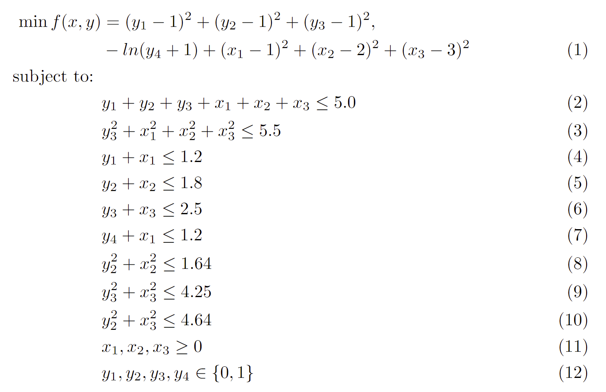
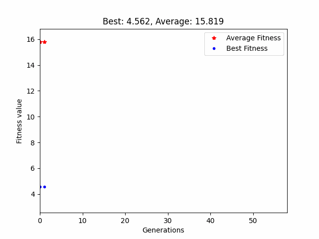

# Real Coded Genetic Algorithm in Python!
rcgapy is a python implemented real coded genetic algorithm [1] to find good local optima
for any linear or nonlinear functions with linear, nonlinear and integer constraints. 

## Environment setup
rcgapy simply depends on numpy and numba for numerical computations and 
matplotlib for visualization.
Just run the following command to get started.

```commandline
pip install -r requirements.txt
```

## Example
In main.py, there is an example how to minimize a nonlinear objective function subject to linear, nonlinear
and integer constraints. 


A few steps are required to model the problem.
1. The objective function can be expressed as:
```python
@njit(fastmath=True)
def objective_function(x):
    r = (x[0] - 1.) ** 2 + (x[1] - 2.) ** 2 + (x[2] - 3.) ** 2 + (x[3] - 1.) ** 2 + (x[4] - 1.) ** 2 + \
        (x[5] - 1.) ** 2 - np.log(x[6] + 1.)
    return r
```
2. All nonlinear constraints are required to be written into a single function
```python
@njit(fastmath=True)
def nonlinear_functions(x):
    const1 = x[5] ** 2 + x[0] ** 2 + x[1] ** 2 + x[2] ** 2 - 5.5
    const2 = x[1] ** 2 + x[4] ** 2 - 1.64
    const3 = x[2] ** 2 + x[5] ** 2 - 4.25
    const4 = x[2] ** 2 + x[4] ** 2 - 4.64
    return const1, const2, const3, const4
```

3. Type of decision variables (real or integer)
```python
x_cts = np.array([0, 1, 2])  # index of continuous variables
x_int = np.array([3, 4, 5, 6])  # index of integer variables
```
4. Bounds of each decision variable
```python
lb_cts = np.array([0., 0., 0.])  # lower bound of continuous variables
ub_cts = np.array([1.2, 1.8, 2.5])  # upper bound of continuous variables
lb_int = np.array([0, 0, 0, 0])  # lower bound of integer variables
ub_int = np.array([1, 1, 1, 1])  # upper bound of integer variables
```
5. Coefficients of linear constraints 

```python
lin_rhs = np.array([[5., 1.2, 1.8, 2.5, 1.2]]).T  # right-hand side of linear inequality constraints
lin_lhs = np.array([  # left-hand side of linear inequality constraints
    [1., 1., 1., 1., 1., 1., 0.],
    [1., 0., 0., 1., 0., 0., 0.],
    [0., 1., 0., 0., 1., 0., 0.],
    [0., 0., 1., 0., 0., 1., 0.],
    [1., 0., 0., 0., 0., 0., 1.]
])
```
Now we are done with the problem setup, just call the opt function to run
```python
# optimize
start = time.perf_counter()
best_obj, best_ind, avg_fit, best_fit, violation = opt(objective_function, x_cts, x_int, lb_cts, ub_cts, lb_int, ub_int,
                                                       lin_lhs, lin_rhs, nonlinear_functions)
global_best_obj = 3.557463
print(f"Gap: {np.round((best_obj - global_best_obj) / global_best_obj, 6)}, total violation: {violation}")
print(f"GA takes {time.perf_counter() - start} seconds to execute. ")
```
The average fitness and best fitness value in each generation can be
visualized by just one line of code:
```python
animation = ga_dynamic_single(avg_fit, best_fit)
```



In demo.py, there is a visualization of the population evolving process on the peaks function


